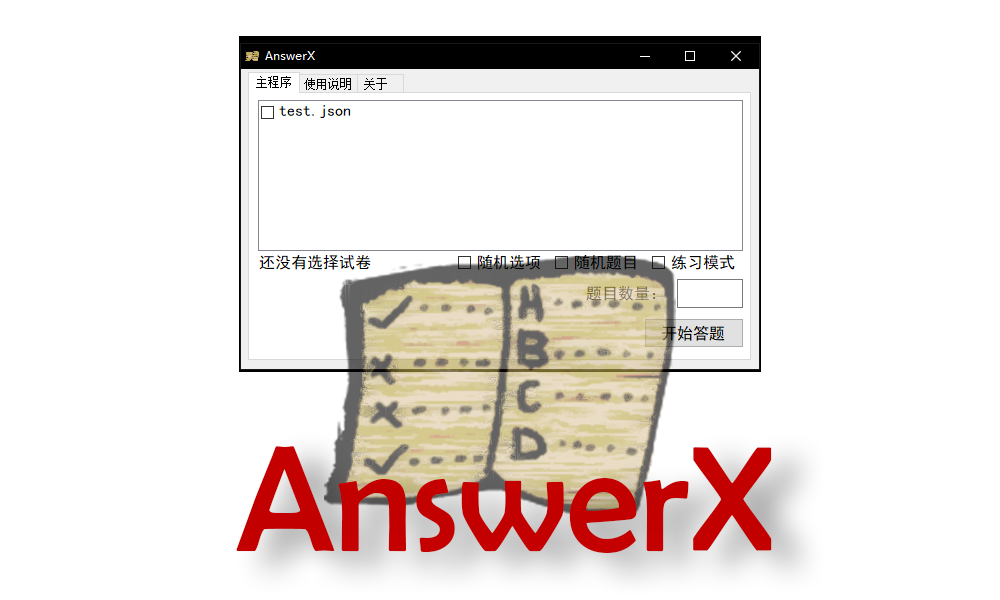

# AnswerX
* 在软件的根目录里的Question文件夹存放的是卷子文件
* 卷子格式：json
* Q_ID：试卷ID号
* Q_TYPE：试卷类型 

* 类型种类：
* Choice  选择题
* TrueOrFalse  判断题
* Multiple_Choice  多选题

* Q_ISSUE：问题
* Q_RIGHT：正确答案 （多选题用英文逗号隔开）
* Q_CHOICE：选项 （ 每个选项用英文逗号隔开）
* Q_SCORE：题目分数

* Config.ini存放的是软件数据

* 软件版本：1.0.0
* 软件作者：hex3f
* 联系方式：hex3f@outlook.com
* 开发语言：C#
* 框架：.NET Framework 4
* 软件开源地址：github.com/hex3f/AnswerX
* 本软件遵循CC BY 4.0协议